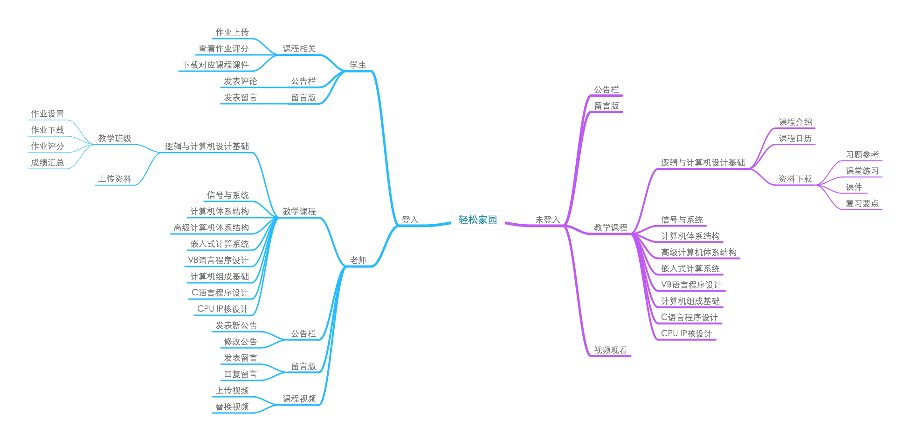
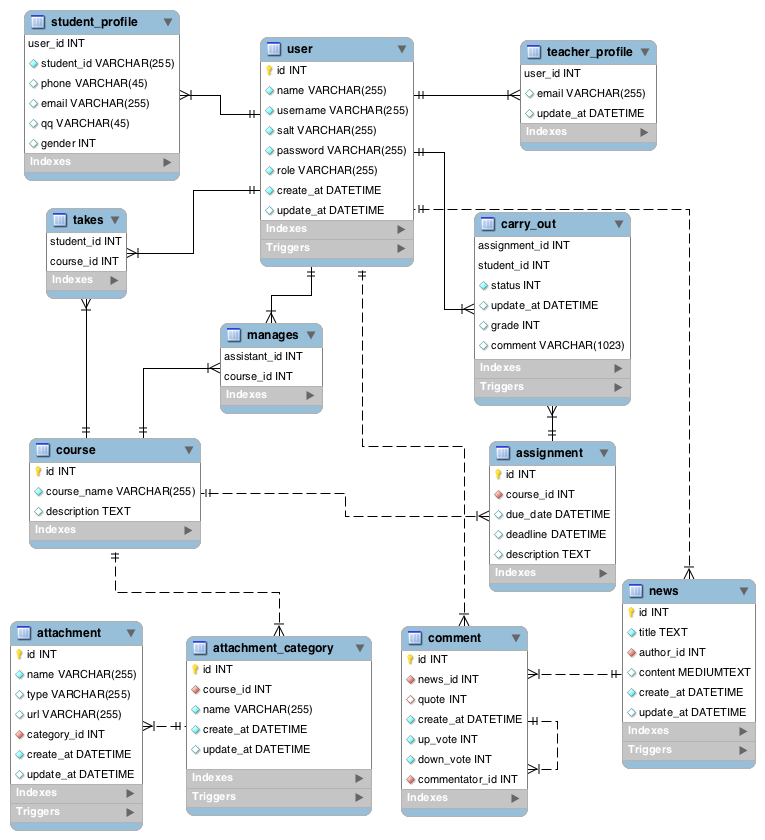

# QSFamily
QSFamily website source code

## Demand Analysis

## Technique Choice

- Backend
    - Language: io.js
    - Framework: Express
    - Database: MySQL (for data storage), Redis (for session storage)
- Frontend
    - UI Framework: Semantic UI
    - MVC Framework: Backbone.js
    - Video Player: video.js

## Database Structure

